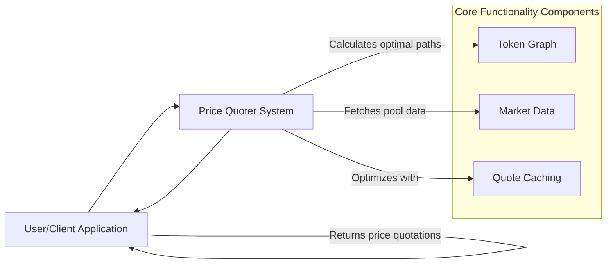
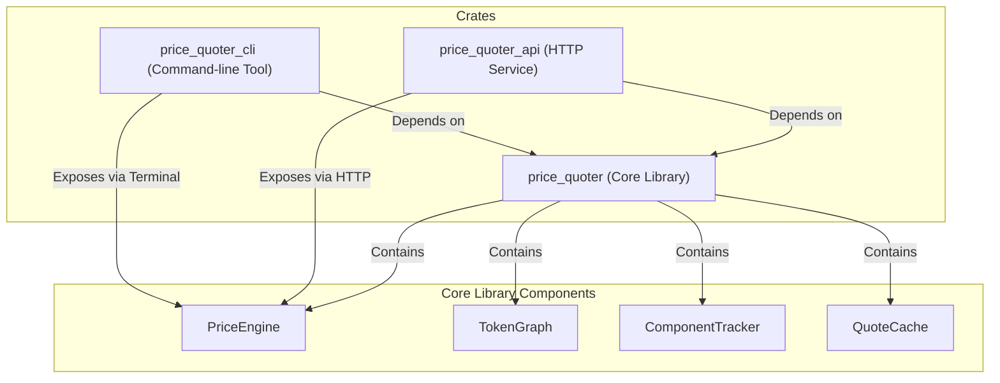
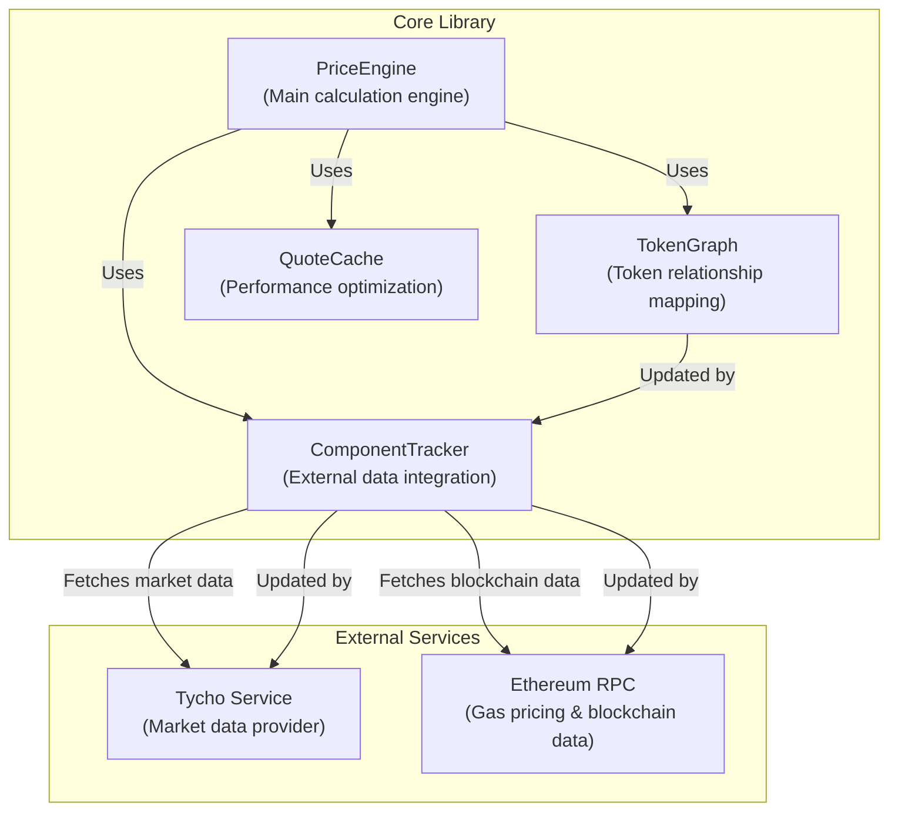
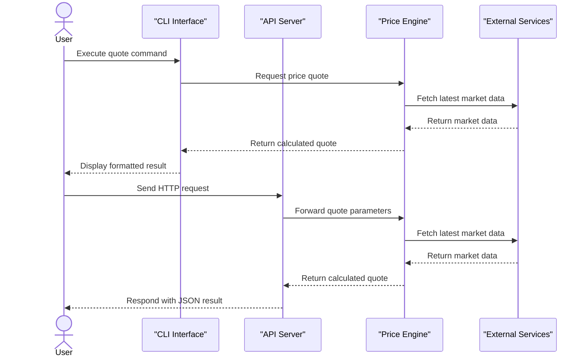
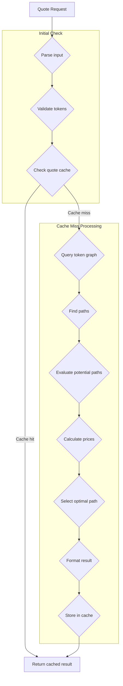

# Price Quoter System Overview

## Overview
This document provides a comprehensive introduction to the Price Quoter System, a Rust-based token swap pricing engine that offers real-time price quotations for cryptocurrency token pairs. The system calculates optimal swap paths and prices based on available liquidity pools and market conditions.

For detailed information on system architecture and component relationships, see System Architecture (document not provided). For implementation specifics of individual components, refer to Core Library (document not provided).

## System Purpose
The Price Quoter System serves as a high-performance engine for providing accurate token swap price quotations across multiple liquidity sources. It is designed to:

- Calculate optimal pricing for token swaps
- Find efficient paths through available liquidity pools
- Provide real-time updates as market conditions change
- Support both API and CLI interfaces for integration and manual usage

## Core Functionality

**Sources:** `crates/price-quoter/Cargo.toml` lines 2-7

## System Components
The Price Quoter System consists of three main crates, each providing distinct functionality while sharing core components:

| Crate                | Purpose            | Key Features                                 |
|----------------------|--------------------|-----------------------------------------------|
| `price-quoter`       | Core library       | Price engine, token graph, component tracking, caching |
| `price-quoter-api`   | HTTP API service   | RESTful endpoints for price quotations        |
| `price-quoter-cli`   | Command-line tool  | Interactive price queries, monitoring         |

### Core Components Diagram

**Sources:** `crates/price-quoter/Cargo.toml` lines 1-55, `crates/price-quoter-api/Cargo.toml` lines 1-7, `crates/price-quoter-cli/Cargo.toml` lines 1-7

## Core Functionality Details
The Price Quoter System's core functionality revolves around calculating optimal pricing for token swaps through its key components:

### Price Engine and Token Graph
- Tokens are represented as nodes in a graph
- Liquidity pools form edges between nodes
- The system finds optimal paths for swaps based on available liquidity and price impact

### Component Tracking and External Integration
- Fetches pool data from the Tycho service
- Updates token relationships dynamically
- Maintains current state information
- Retrieves gas prices from Ethereum RPC nodes

### Core Library Implementation Diagram

**Sources:** `crates/price-quoter/Cargo.toml` lines 14-52

## User Interfaces
The Price Quoter System provides two distinct interfaces for accessing quotation functionality:

### API Service
The `price-quoter-api` crate exposes HTTP endpoints for requesting price quotes programmatically:
- RESTful API for price quotations
- Health monitoring endpoints
- JSON-based request/response format
- Built using Axum framework

### CLI Tool
The `price-quoter-cli` crate provides a command-line interface for interactive use:
- Command-line arguments for one-off quotes
- Interactive REPL mode for continuous usage
- Price history monitoring
- Supports various output formats

### Interaction Sequence Diagram

**Sources:** `crates/price-quoter-api/Cargo.toml` lines 6-15, `crates/price-quoter-cli/Cargo.toml` lines 6-20

## Key System Features

### Batch Processing and Caching
- Can calculate a single token pair quote
- Supports calculating multiple quotes against a reference token (e.g., ETH)
- Implements intelligent caching for performance optimization
- Employs cache invalidation strategies to maintain accuracy

### Path Optimization
- Graph-based path finding algorithms
- Support for multi-hop swaps
- Consideration of price impact
- Optimization for slippage and gas costs

### Price Quotation Process Flowchart

**Sources:** `crates/price-quoter/Cargo.toml` lines 8-12, 24-35

## Technical Implementation
The system is built entirely in Rust, leveraging the language's strengths:

| Feature                | Implementation                          |
|------------------------|-----------------------------------------|
| Concurrency            | Uses Tokio for asynchronous processing   |
| Graph algorithms       | Utilizes petgraph for token relationship modeling |
| Caching                | Implements LRU caching strategy          |
| Mathematical precision | Uses rust_decimal for accurate calculations |
| API framework          | Built with Axum for HTTP endpoints       |
| Command parsing        | Uses Clap for CLI argument handling      |

The system architecture follows a modular design with clear separation of concerns, ensuring maintainability and extensibility. The core functionality is encapsulated in the `price-quoter` library, which is then used by both the API and CLI interfaces.

**Sources:** `crates/price-quoter/Cargo.toml` lines 14-52, `crates/price-quoter-api/Cargo.toml` lines 6-15, `crates/price-quoter-cli/Cargo.toml` lines 6-20 